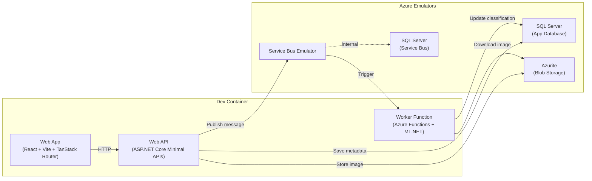

# SnapSort

An image classification application built as a polyglot monorepo to demonstrate **dev container composition** with **Azure emulation**. Built for a lunch-and-learn on achieving better developer experience with dev containers.

## What It Does

Upload an image through the web UI. The API stores it in Azure Blob Storage, saves metadata in SQL Server, and publishes a message to Azure Service Bus. A background Worker Function picks up the message, runs the image through a pre-trained **MobileNet v2** model using **ML.NET**, and writes the classification label and confidence score back to SQL. The web app displays a gallery of uploaded images with their classification results.

## Architecture



## Tech Stack

| Component | Technology |
|---|---|
| Web App | React 19, Vite, TanStack Router, TypeScript, pnpm |
| Web API | ASP.NET Core Minimal APIs, .NET 9 |
| Worker | Azure Functions (isolated worker), ML.NET, MobileNet v2 ONNX |
| Shared Library | Entity Framework Core, SQL Server provider |
| Dev Container | Debian Bookworm base, Node.js + .NET as features |
| Blob Storage | Azurite emulator |
| Message Bus | Azure Service Bus Emulator |
| Database | SQL Server 2022 (two instances: app + Service Bus) |

## Project Structure

```
apps/           Deployable code units
  web-app/      React frontend (image gallery + upload)
  web-api/      ASP.NET Core API (CRUD, upload, Service Bus publish)
  worker/       Azure Functions (Service Bus trigger, ML.NET classification)

libs/           Shared libraries
  data/         EF Core models, DbContext, migrations (shared by API + Worker)

.devcontainer/  Dev container configuration
  Dockerfile    Base image with zsh, fzf, Claude Code
  docker-compose.yml  All services (devcontainer + 4 emulators)
  devcontainer.json   Features, extensions, port forwarding
  servicebus-config.json  Queue definitions
```

## Getting Started

### Prerequisites

- [Docker Desktop](https://www.docker.com/products/docker-desktop/)
- [VS Code](https://code.visualstudio.com/) with the [Dev Containers extension](https://marketplace.visualstudio.com/items?itemName=ms-vscode-remote.remote-containers)

### Setup

1. Clone the repo
2. Open in VS Code
3. When prompted, click **"Reopen in Container"** (or run `Dev Containers: Reopen in Container` from the command palette)
4. Wait for the container to build and all services to start

### Running the Apps

From inside the dev container:

```bash
# Web API (terminal 1)
cd apps/web-api
dotnet run

# Worker Function (terminal 2)
cd apps/worker
func start

# Web App (terminal 3)
cd apps/web-app
pnpm dev
```

### Ports

| Port | Service |
|---|---|
| 5173 | Vite dev server (web app) |
| 5000 | ASP.NET Core API |
| 7071 | Azure Functions (worker) |
| 1433 | SQL Server (app database) |
| 1434 | SQL Server (Service Bus) |
| 5672 | Service Bus (AMQP) |
| 5300 | Service Bus (management) |
| 10000 | Azurite Blob |
| 10001 | Azurite Queue |
| 10002 | Azurite Table |

## Key Takeaways (for the talk)

- **Dev containers eliminate "works on my machine"** — the entire environment is defined in code
- **Azure emulators remove the need for cloud infrastructure during development** — no Azure subscription required
- **Docker Compose orchestrates everything** — one command spins up 5 services
- **Polyglot monorepos work well with dev containers** — Node.js and .NET coexist cleanly via features
- **Shared libraries across projects** — `libs/data` is referenced by both API and Worker, keeping the data layer DRY
