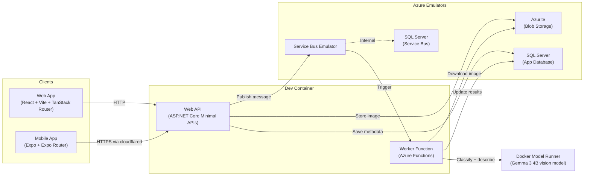

# SnapSort

An image classification application built as a polyglot monorepo to demonstrate **dev container composition** with **Azure emulation**. Built for a lunch-and-learn on achieving better developer experience with dev containers.

## What It Does

Upload an image through the web UI (or the Expo mobile app). The API stores it in Azure Blob Storage, saves metadata in SQL Server, and publishes a message to Azure Service Bus. A background Worker Function picks up the message and sends it to a local **Gemma 3** vision model running under **Docker Model Runner**, which returns a classification label and a written description in a single call. Both are written back to SQL. The gallery shows each image with its results.

## Architecture



## Tech Stack

| Component      | Technology                                                                              |
| -------------- | --------------------------------------------------------------------------------------- |
| Web App        | React 19, Vite, TanStack Router, React Query, TypeScript                                |
| Mobile App     | Expo SDK 54, Expo Router, React Native 0.81, TypeScript                                 |
| Web API        | ASP.NET Core Minimal APIs, .NET 10, Scalar API reference                                |
| Worker         | Azure Functions (isolated worker), .NET 10                                              |
| Vision Model   | Gemma 3 4B (`ai/gemma3:4B-Q4_K_M`) via Docker Model Runner                              |
| Shared Library | Entity Framework Core, SQL Server provider                                              |
| Node tooling   | pnpm workspace (one lockfile at the repo root)                                          |
| Dev Container  | Debian Bookworm base; Node.js, .NET, Azure Functions Core Tools, GitHub CLI as features |
| Blob Storage   | Azurite emulator                                                                        |
| Message Bus    | Azure Service Bus Emulator                                                              |
| Database       | SQL Server 2022 (two instances: app + Service Bus)                                      |

## Project Structure

```
apps/           Deployable code units
  web-app/      React frontend (image gallery + upload)
  mobile/       Expo Router app (gallery + camera/library upload)
  web-api/      ASP.NET Core API (CRUD, upload, Service Bus publish)
  worker/       Azure Functions (Service Bus trigger, classification + description)

libs/           Shared libraries
  data/         EF Core models, DbContext, migrations (shared by API + Worker)

tests/          Test projects
  unit/         Unit tests (Image model, ImageAnalyzer)
  integration/  Integration tests (API endpoints via WebApplicationFactory)

scripts/        Host- and container-side helper scripts
  new-worktree.sh       Create a sibling worktree for a parallel dev container
  remove-worktree.sh    Tear down a worktree's stack and remove it
  migrate-to-bare-layout.sh  One-time conversion to the bare-repo layout
  mobile-tunnel.sh      cloudflared tunnel + Expo tunnel for phone testing
  seed.sh / reset.sh    Demo data helpers
  check-worktree-isolation.sh  Assert the invariants that keep worktrees independent
  welcome.sh            postAttach greeting

docs/           Longer-form documentation
  devcontainer-worktrees.md  Running parallel dev containers per worktree

.devcontainer/  Dev container configuration
  Dockerfile              Base image plus zsh, fzf, jq, cloudflared, Claude Code
  docker-compose.yml      All services (devcontainer + 4 emulators + model)
  devcontainer.json       Features, extensions, port forwarding, lifecycle hooks
  devcontainer-lock.json  Pinned feature versions
  init.sh                 Host-side initializeCommand (worktree name, shared volume)
  servicebus-config.json  Queue definitions
```

Node tooling is one pnpm workspace rooted at the repo root: `pnpm-workspace.yaml`
lists `apps/web-app` and `apps/mobile`, `package.json` holds the shortcut scripts,
and there is a single `pnpm-lock.yaml`. Run `pnpm install` from the root, never
from inside an app.

.NET projects are gathered by `SnapSort.slnx` at the repo root, and `dotnet-ef` is
pinned in `.config/dotnet-tools.json`.

Versions are pinned in one place each: `global.json` for the SDK,
`Directory.Build.props` for the target framework, `Directory.Packages.props` for every
NuGet version (Central Package Management), `devcontainer-lock.json` for dev container
features, and exact image tags in `docker-compose.yml`.

Prettier, ESLint and `dotnet format` run on staged files via husky + lint-staged, and
commitlint enforces Conventional Commits — see `lint-staged.config.js`.

## Getting Started

### Prerequisites

- [Docker Desktop](https://www.docker.com/products/docker-desktop/)
- [VS Code](https://code.visualstudio.com/) with the [Dev Containers extension](https://marketplace.visualstudio.com/items?itemName=ms-vscode-remote.remote-containers)
- Docker Model Runner enabled in Docker Desktop — the Worker calls a local Gemma 3
  vision model through it, and will not start without `VisionModel__Endpoint` set
- Optional: `gh auth login` on the **host**. The container bind-mounts
  `~/.config/gh`, so the GitHub CLI inside it inherits that login. On macOS the
  token has to be in `~/.config/gh/hosts.yml` rather than the Keychain, which
  means logging in once with `gh auth login --insecure-storage`.

### Setup

1. Clone the repo
2. Open in VS Code
3. When prompted, click **"Reopen in Container"** (or run `Dev Containers: Reopen in Container` from the command palette)
4. Wait for the container to build and all services to start

That is the whole setup. The lifecycle hooks do the rest:

| Hook                | What it does                                                                                                                                                                  |
| ------------------- | ----------------------------------------------------------------------------------------------------------------------------------------------------------------------------- |
| `initializeCommand` | `.devcontainer/init.sh` on the **host** — writes the worktree name for compose, creates the shared Claude config volume, and ensures `~/.config/gh` exists for the bind mount |
| `postCreateCommand` | Restores .NET packages and `dotnet-ef`, installs the pnpm workspace                                                                                                           |
| `postStartCommand`  | Applies EF migrations (`dotnet ef database update`)                                                                                                                           |
| `postAttachCommand` | Prints the welcome banner                                                                                                                                                     |

### Running

Use VS Code tasks (Terminal > Run Task) or run manually:

```bash
# Web API (terminal 1)
cd apps/web-api && dotnet run

# Worker Function (terminal 2)
cd apps/worker && dotnet run

# Web App (terminal 3)
pnpm web            # from the repo root

# Mobile app, on a phone running Expo Go
pnpm mobile:tunnel  # cloudflared + Expo tunnel; scan the QR code
```

Or use the **API + Worker** compound launch configuration (F5) for debugging, and the **web-app: dev** task for the frontend.

The API serves a Scalar API reference at [localhost:5000/scalar](http://localhost:5000/scalar), and the web app has a service status page at [localhost:5173/status](http://localhost:5173/status).

### Ports

Compose publishes **nothing** to the host — services talk to each other over the
compose network, which is what lets several worktrees run their own stacks side by
side without collisions. VS Code forwards these out of the container:

| Port        | Service                   |
| ----------- | ------------------------- |
| 5173        | Vite dev server (web app) |
| 5000        | ASP.NET Core API          |
| 7071        | Azure Functions (worker)  |
| 8081        | Metro bundler (mobile)    |
| 19000-19002 | Expo dev tools            |

Reachable from inside the dev container only, by service hostname:

| Host:port                    | Service                                |
| ---------------------------- | -------------------------------------- |
| `app-mssql:1433`             | SQL Server (app database)              |
| `servicebus-mssql:1433`      | SQL Server (Service Bus backing store) |
| `servicebus-emulator:5672`   | Service Bus (AMQP)                     |
| `servicebus-emulator:5300`   | Service Bus (management)               |
| `azurite:10000-10002`        | Azurite Blob / Queue / Table           |
| `host.docker.internal:12434` | Docker Model Runner (vision model)     |

### Testing

```bash
# All tests
dotnet test SnapSort.slnx

# Unit tests only
dotnet test tests/unit

# Integration tests only
dotnet test tests/integration
```

### Parallel worktrees

The dev container is set up so each git worktree gets its own container and its own
sidecar services. Create one from the host shell with `scripts/new-worktree.sh`, and
remove it with `scripts/remove-worktree.sh`. See
[docs/devcontainer-worktrees.md](docs/devcontainer-worktrees.md) for the layout, how
the isolation works, and the gotchas.

The isolation is checked, not assumed:

```bash
scripts/check-worktree-isolation.sh
```

It asserts no host ports are published, no `appPort` is used, only the intended volumes
are shared, and git is configured for worktrees. The static pass runs anywhere; the live
pass inspects running Docker state and so needs to run on the host.

## Key Takeaways (for the talk)

- **Dev containers eliminate "works on my machine"** — the entire environment is defined in code
- **Azure emulators remove the need for cloud infrastructure during development** — no Azure subscription required
- **Docker Compose orchestrates everything** — one command spins up 5 containers plus a local model
- **Polyglot monorepos work well with dev containers** — Node.js and .NET coexist cleanly via features
- **Shared libraries across projects** — `libs/data` is referenced by both API and Worker, keeping the data layer DRY
- **Local models are just another compose service** — Docker Model Runner serves an OpenAI-compatible endpoint, so no cloud AI dependency either
- **Publishing no ports enables parallelism** — several worktrees each run a full stack at once
