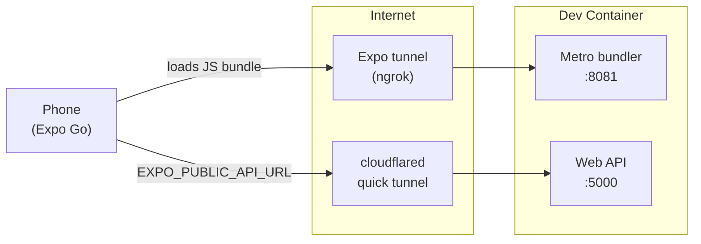

# SnapSort Mobile (Expo)

Expo Router app that lists and uploads images against the SnapSort API.

## First run

```bash
pnpm install                          # from the REPO ROOT — one pnpm workspace
cp apps/mobile/.env.example apps/mobile/.env   # then edit EXPO_PUBLIC_API_URL
pnpm mobile:tunnel                    # Metro + Expo Go tunnel
```

Scan the QR code in the terminal with the Expo Go app (iOS App Store / Play Store).

## Networking from a dev container

Two servers have to be reachable from the phone, and they are exposed separately:



Expo's tunnel exposes Metro so Expo Go can download the bundle; cloudflared
exposes the API so the running app can call it. A quick tunnel maps one hostname
to one port, so one tunnel cannot cover both.

`pnpm mobile:tunnel` (from the repo root) sets up both: it starts cloudflared
against port 5000, writes the generated URL into `.env` as `EXPO_PUBLIC_API_URL`,
then starts Expo in tunnel mode. On first run Expo installs `@expo/ngrok` on
demand — it is not in the lockfile.

### On the same LAN

Metro listens on `8081` and Expo CLI uses `19000-19002`. Those are forwarded in
`.devcontainer/devcontainer.json`, so plain `pnpm start` works when the phone is
on the same network as the host. The API still needs a reachable URL — either
right-click the `5000` row in the VS Code Ports panel and set visibility to
Public, or point `EXPO_PUBLIC_API_URL` at `http://<host-lan-ip>:5000`.

Plain `http://localhost:5000` only works for the web target (`pnpm web`), not
Expo Go on a physical phone.

## Scripts

Run these from `apps/mobile/`, or from the repo root as
`pnpm --filter mobile <script>`. Note that root-level `pnpm web` is the React web
app, while `pnpm web` here is the Expo web target.

- `pnpm start` — Metro in LAN mode
- `pnpm tunnel` — Metro in tunnel mode (works from anywhere)
- `pnpm web` — web preview at http://localhost:8081
- `pnpm ios` / `pnpm android` — open in local simulator/emulator (host-side)
